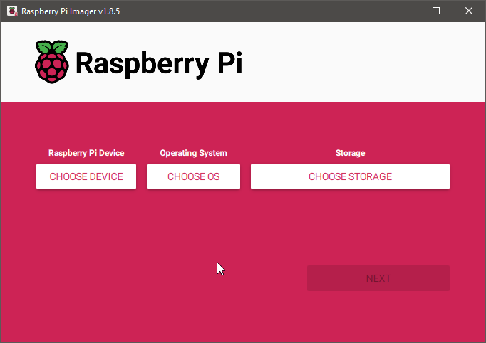

## Setting up monitor mode on Raspberry Pi Zero 2 W

#### Background
- Bought this 2 weeks ago, Had the chip mentioned on the [nexmon](nexmon.org/) website.

# RUN ONLY ON LINUX

#### Steps : Flashing
##### Note: The installation is bit tricky as it doesnt come with the required firmware for wifi and downgrading it to lower RPI OS is not successful. Kali comes with its own problems and limits what the RPI can do.

1. Download and install the Latest Raspberry Pi Imager from the official website

2. Open it 

3. Select the Pi zero 2w Device 

4. OS selection is the Important part here, click the  and select the Raspberry Pi OS (Other) and then *Raspberry Pi OS (legacy, 64-bit) Lite* 

5. Insert the SD card and select storage and hit next into the configuration settings. 

6. Enable ssh, give device name and password and write image to the SD card. 
- I havent entered network details as I will be using Ethernet Adapter (USB to Ethernet)

7. Insert the Sd card into the RPI and Power it up 

#### Steps : Driver setup and Monitor mode

1. SSH into your RPI, get its IP from your Router or Nmap scan. 

2. Update the RPI and install the required packages
```bash
sudo apt update && sudo apt upgrade -y
```

3. Install required packages from seemon repository on github
```bash
sudo apt install raspberrypi-kernel-headers git libgmp3-dev gawk qpdf bison flex make autoconf libtool texinfo -y
```
```bash
sudo dpkg --add-architecture armhf
```
```bash
sudo apt-get update
```
```bash
sudo apt-get install libc6:armhf libisl23:armhf libmpfr6:armhf libmpc3:armhf libstdc++6:armhf -y
```

4. grepping the dmesg for the wifi chip gets us the firmware version and the chip version ```version 7.45.96.s1``` which is not supported by nexmon patch. We need to downgrade the firmware to ```version 7.45.41.46``` as mentioned in this [issue](https://github.com/seemoo-lab/nexmon/issues/619#issuecomment-2321708881)


5. We wget the deb file and install it directly
```bash
wget http://archive.raspberrypi.org/debian/pool/main/f/firmware-nonfree/firmware-brcm80211_0.43+rpi6_all.deb
```
```bash
sudo apt install ./firmware-brcm80211_0.43+rpi6_all.deb -y --allow-downgrades
```
```bash
sudo mv /lib/firmware/cypress /lib/firmware/cypress.bak  # 
sudo mkdir /lib/firmware/cypress 
sudo reboot
```
6. grepping the dmesg for the wifi chip shows that the firmware has been downgraded.


#### Steps : Nexmon patch
0. Confirm if you have the following files:
```bash
ls /usr/lib/arm-linux-gnueabihf/ | grep libisl.so.23.0.0
```
```bash
ls /usr/lib/arm-linux-gnueabihf/ | grep libmpfr.so.6.1.0
```


1. in the root dir, clone the nexmon repo and execute the following commands
```bash
git clone https://github.com/seemoo-lab/nexmon.git
```
```bash
cd nexmon
```
```bash
source setup_env.sh
```
```bash
make
```
```bash
cd patches/bcm43430a1/7_45_41_46/nexmon/
```
```bash
sudo ln -s /usr/lib/arm-linux-gnueabihf/libisl.so.23.0.0  /usr/lib/arm-linux-gnueabihf/libisl.so.10
```
```bash
sudo ln -s /usr/lib/arm-linux-gnueabihf/libmpfr.so.6.1.0 /usr/lib/arm-linux-gnueabihf/libmpfr.so.4
```
```bash
make
```
```bash
make install-firmware
```

2. After running install-firmware the output of iw list you can see monitor mode is supported


3. Now the final step is to persist the drivers after reboot or else you would have to run the make install-firmware command everytime you reboot.
